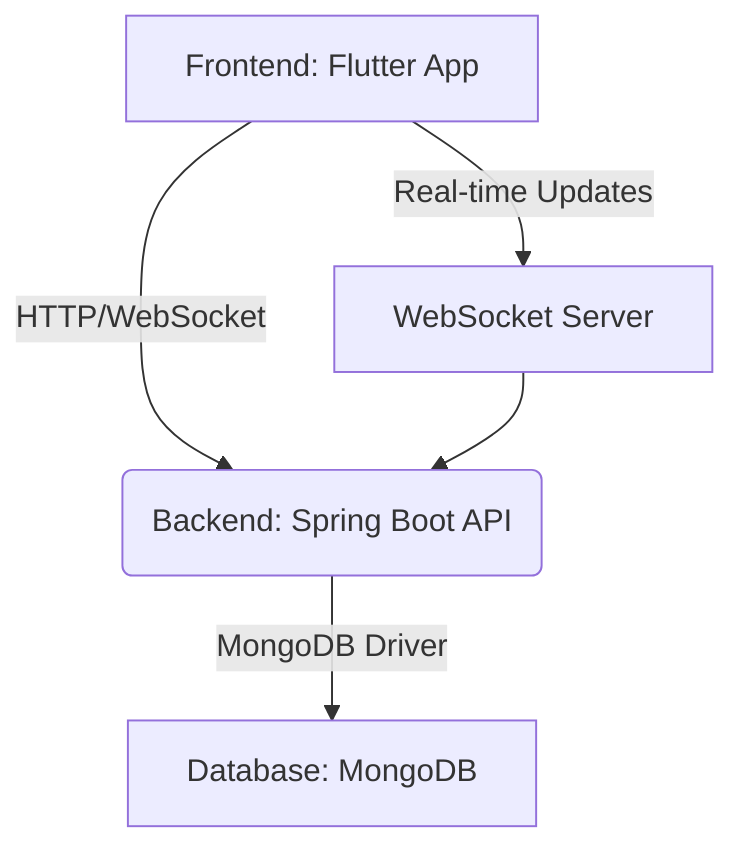

# SyncForge

SyncForge is a collaborative project management tool designed for teams to streamline their workflow, manage tasks, and facilitate communication. It provides a centralized platform for creating projects, assigning tasks, tracking progress, and collaborating on files.

## Features

*   **User Authentication and Authorization**: Secure user registration, login, and role-based access control.
*   **Project Management**: Create, view, and manage projects. Add members to projects with different roles.
*   **Task Management**: Create tasks within projects, assign them to members, update their status, and track progress.
*   **File Management**: Upload and manage files associated with projects.
*   **Real-time Communication**: WebSocket-based notifications and communication for real-time updates on project activities, task changes, and new comments.
*   **Comment System**: Add comments to tasks and files for discussion and feedback.

## Technologies Used

### Backend (Spring Boot)

*   **Spring Boot**: Framework for building the backend application.
*   **Spring Security**: For authentication and authorization (JWT).
*   **Spring WebSockets**: For real-time communication.
*   **Spring Data MongoDB**: For database interaction.
*   **Lombok**: To reduce boilerplate code.
*   **jjwt**: Java JWT (JSON Web Token) library.

### Frontend (Flutter)

*   **Flutter**: UI toolkit for building natively compiled applications for mobile, web, and desktop from a single codebase.
*   **Provider**: State management.
*   **http**: For making HTTP requests.
*   **file_picker**: For picking files from the device.
*   **path_provider**: For accessing platform-specific directories.
*   **permission_handler**: For managing permissions.
*   **web_socket_channel**: For WebSocket communication.
*   **flutter_secure_storage**: For securely storing data.
*   **google_fonts**: For custom fonts.
*   **stomp_dart_client**: STOMP client for Dart.

## Getting Started

### Prerequisites

*   Java Development Kit (JDK) 21 or higher
*   Flutter SDK
*   Docker and Docker Compose
*   MongoDB (or use Docker Compose for a containerized MongoDB instance)

### Installation

1.  **Clone the repository**:

    ```bash
    git clone https://github.com/your-username/SyncForge.git
    cd SyncForge
    ```

2.  **Start the MongoDB database (using Docker Compose)**:

    ```bash
    docker-compose up -d mongo
    ```

3.  **Backend Setup**:

    ```bash
    cd backend
    ./mvnw spring-boot:run
    ```
    The backend will run on `http://localhost:8080`.

4.  **Frontend Setup**:

    ```bash
    cd ../frontend/syncforge_frontend
    flutter pub get
    flutter run
    ```
    The Flutter app will launch on your configured device or browser.

## Project Structure

```
SyncForge/
├── backend/               # Spring Boot backend application
│   ├── src/
│   │   ├── main/
│   │   │   ├── java/com/syncforge/ # Main application source code
│   │   │   ├── resources/          # Configuration files
│   │   └── test/                   # Test code
│   ├── Dockerfile                  # Dockerfile for the backend
│   ├── pom.xml                     # Maven project file
│   └── ...
├── frontend/              # Flutter frontend application
│   └── syncforge_frontend/ 
│       ├── lib/                    # Dart source code
│       ├── assets/                 # Image and font assets
│       ├── android/                # Android specific files
│       ├── ios/                    # iOS specific files
│       ├── web/                    # Web specific files
│       ├── pubspec.yaml            # Flutter project dependencies
│       └── ...
├── docker-compose.yml     # Docker Compose configuration
└── README.md              # Project documentation (this file)
```

## System Architecture



## Contributing

Contributions are welcome! Please fork the repository and submit pull requests.

## License

This project is licensed under the MIT License - see the LICENSE.md file for details. (Note: LICENSE.md file not yet created, this is a placeholder.)
